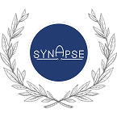

# Synapse medical system - Техническая документация дизайна

> Язык документации: русский\
> Текущая версия: 1.0.0

       

---

В этой папке находится структура технической дизайн-документации для Synapse System.

Synapse System — это медицинская ERP-платформа для клиник, больниц и других медицинских организаций. Шаблоны в этой папке адаптированы под операционные, клинические, финансовые, пациентские, складские, safety- и accreditation-related сценарии, включая требования, связанные с JCI.

## Рекомендуемый порядок работы

1. Заполнить `0.1-scope-and-goals.md` для выбранной фичи или версии.
2. Заполнить `0.2-modules-and-interface-map.md`, указав все страницы в scope.
3. Для каждой страницы скопировать `pages/_page-spec-template.md` в `pages/<page-name>.md`.
4. Обновлять `changelog/README.md` после каждого согласованного изменения дизайна.
