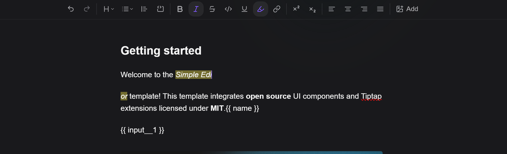

# 2.2. Редактор документов — Техническое задание для дизайнера

## Что такое редактор документов

Редактор документов — это WYSIWYG-компонент для создания переиспользуемых шаблонов медицинских и иных документов. Пользователь строит структуру документа визуально: добавляет текст, таблицы, изображения, вставляет переменные (данные из системы) и поля ввода (данные, которые будут заполнены пользователем при создании документа по шаблону).

Итоговый документ хранится в HTML-формате. Редактор отображает его визуально, не показывая пользователю код.

---

## Общий layout компонента

```
┌─────────────────────────────────────────────────────────────────┐
│  TOOLBAR (фиксированная, прилипает к верху редактора)           │
│  [Документ ▾] [Жирный] [Курсив] [Зач.] [Подч.] [Цвет ▾]       │
│  [Размер ▾] [← ↔ →] [Изображение ▾] [Таблица ▾] [Список ▾]     │
│  [Переменная ▾] [+ Поле ввода]                                  │
├─────────────────────────────────────────────────────────────────┤
│                                                                 │
│  РАБОЧАЯ ОБЛАСТЬ (белый лист документа, скроллится вертикально) │
│                                                                 │
│  ┌─────────────────────────────────────────────────────────┐   │
│  │                                                         │   │
│  │  Текстовый контент, таблицы, изображения,               │   │
│  │  переменные и поля ввода                                │   │
│  │                                                         │   │
│  └─────────────────────────────────────────────────────────┘   │
│                                                                 │
└─────────────────────────────────────────────────────────────────┘
```

- Toolbar: фиксированная панель у верхнего края редактора. При скролле документа прилипает к верху.
- Рабочая область: белый прямоугольник, имитирующий лист документа (A4), центрированный горизонтально. Скроллится вертикально при длинном контенте.
- Общий фон вокруг "листа": нейтральный серый — чтобы граница листа была читаема.



---

## Панель инструментов (Toolbar) — детализация

### Группировка кнопок

Кнопки toolbar сгруппированы по смысловым блокам. Между группами — визуальный разделитель (вертикальная линия).

```
[Документ ▾] | [B] [I] [S] [U] [A▾] [14▾] [← ↔ → ↔↔] | [🖼 ▾] [⊞ ▾] [≡ ▾] | [{{ }} ▾] [+ Поле]
```

**Блок 1: Документ**
- Кнопка-дропдаун "Документ" — управление макетом документа.
- Открывает панель с вариантами:
  - Одна колонка (по умолчанию)
  - Две колонки

**Блок 2: Форматирование текста**
- `B` — жирный (toggle)
- `I` — курсив (toggle)
- `S` — зачёркнутый (toggle)
- `U` — подчёркнутый (toggle)
- `A▾` — цвет текста (открывает color picker)
- `14▾` — размер шрифта (открывает дропдаун или inline-input со значением)
- Кнопки выравнивания: по левому краю, по центру, по правому краю, по ширине (toggle-группа, одна активна)

**Блок 3: Медиа и структура**
- `Изображение ▾` — дропдаун с вариантами: загрузить файл, drag & drop зона, вставить по URL; также удалить выбранное изображение
- `Таблица ▾` — дропдаун с действиями: добавить таблицу, добавить строку, убрать строку, добавить столбец, убрать столбец, объединить ячейки, закрасить ячейки
- `Список ▾` — дропдаун: добавить маркированный список, добавить нумерованный список, удалить список

**Блок 4: Вставки**
- `{{ }} Переменная ▾` — дропдаун-поиск по списку переменных (см. ниже)
- `+ Поле ввода` — кнопка, открывающая модальное окно создания поля ввода

---

## Рабочая область — элементы документа

### 1. Текст

- Стандартный inline-текст. Курсор появляется при клике.
- Выделенный текст подсвечивает toolbar-кнопки активного форматирования.
- Пустая строка показывает плейсхолдер: "Начните вводить текст..." (серый, исчезает при вводе).

### 2. Изображение

- Изображение отображается по фактическому размеру или масштабированным под ширину колонки.
- При выборе изображения (клик) появляются ручки изменения размера (resize handles) по углам и по бокам.
- Выбранное изображение обведено рамкой с акцентным цветом.
- Курсор при hover над ручкой — resize cursor.
- Вверху выбранного изображения — плавающая мини-панель: [Изменить] [Удалить].

```
┌─────────────────────────────────┐
│         [Изменить] [Удалить]    │  ← мини-панель при выборе
├─────────────────────────────────┤
│                                 │
│         [изображение]           │  ← resize handle по углам
│                                ○│  ← ○ = ручка изменения размера
└─────────────────────────────────┘
```

**Drop area (для загрузки изображения):**
- Зона drag & drop — пунктирная рамка, иконка загрузки, текст "Перетащите изображение или нажмите для выбора файла". Должен быть совмещён с дополнительным инпутом для указания ссылки на файл. Может быть указана ссылка на файл или файл загружен через drop area или file input
- При наведении файла — рамка меняет цвет, текст меняется на "Отпустите для загрузки".
- Пока изображение загружается — прогресс-бар или spinner внутри зоны.

### 3. Таблица

- Таблица отображается с видимыми границами ячеек.
- При hover на строку/столбец — появляются управляющие кнопки добавления (+) рядом с крайней строкой/столбцом.
- Выбранная ячейка подсвечивается.
- Объединённые ячейки визуально сливаются (без внутренней границы).
- Закрашенная ячейка имеет фоновый цвет выбранного цвета.
- При выделении нескольких ячеек (drag) toolbar таблицы активируется для группового действия.

```
┌──────────┬──────────┬──────────┐  ←  [+] справа для добавления столбца
│  Ячейка  │  Ячейка  │  Ячейка  │
├──────────┼──────────┼──────────┤
│  Ячейка  │  Ячейка  │  Ячейка  │  ← [+] снизу для добавления строки
└──────────┴──────────┴──────────┘
```

### 4. Список

- Маркированный: точки/тире.
- Нумерованный: 1. 2. 3.
- Стиль визуально совпадает с системным стилем типографики.

### 5. Переменная

Переменная отображается как **inline-чип** (pill/highlighted) внутри текста.

```
Пациент: [ФИО пациента]  дата рождения: [Дата рождения пациента]
```

- Чип имеет заливку фоновым акцентным цветом (например, светло-синий или лавандовый).
- Внутри чипа — человекочитаемое название переменной (не технический синтаксис).
- Чип — неразрывный инлайн-элемент: его нельзя редактировать текстом, только удалить целиком.
- При hover — tooltip с техническим именем переменной (например, `var__patient_name`).
- При клике на чип — он выбирается (обводится), клавиша Delete/Backspace удаляет его.

**Визуальные состояния чипа переменной:**

| Состояние | Описание |
|-----------|----------|
| default | Светло-синий фон, тёмный текст |
| hover | Чуть темнее фон, появляется tooltip |
| selected | Обводка акцентного цвета, слегка темнее фон |

### 6. Поле ввода

Поле ввода отображается как **inline-чип** (pill/highlighted) внутри текста, но визуально отличается от переменных.

```
Диагноз: [📝 Диагноз пациента]  Назначение: [📋 Назначение]
```

- Чип имеет другой цвет заливки от переменных (например, светло-зелёный или янтарный).
- Иконка типа поля (карандаш для input, список для select и т.д.) перед названием.
- Название поля — свойство `name` из схемы поля ввода.
- При hover — tooltip: тип поля, обязательное или нет.
- При клике — выбирается, Delete/Backspace удаляет из документа.
- Удаление чипа из документа не удаляет само поле ввода из системы.

**Визуальные состояния чипа поля ввода:**

| Состояние | Описание |
|-----------|----------|
| default | Светло-зелёный/янтарный фон, тёмный текст |
| hover | Чуть темнее фон, tooltip с типом и обязательностью |
| selected | Обводка акцентного цвета |

**Иконки типов полей ввода:**

| Тип | Иконка |
|-----|--------|
| `input` | Текстовое поле (T или карандаш) |
| `number_input` | Цифра или # |
| `file_input` | Скрепка или файл |
| `select` | Один выбор из списка (шеврон вниз) |
| `multi_select` | Множественный выбор (галочки) |

---

## Дропдаун "Переменная ▾" — список переменных

При нажатии открывается выпадающая панель с поиском и сгруппированным списком.

```
┌─────────────────────────────────┐
│  🔍 Поиск переменной...         │
├─────────────────────────────────┤
│  📅 Дата и время                │
│    ○ Текущая дата               │
│    ○ Текущая дата и время       │
├─────────────────────────────────┤
│  🏥 Клиника и филиал            │
│    ○ Название клиники           │
│    ○ Логотип клиники            │
│    ○ Название филиала           │
│    ○ ...                        │
├─────────────────────────────────┤
│  👨‍⚕️ Врач                        │
│    ○ Фамилия врача              │
│    ○ Имя врача                  │
│    ○ Отчество врача             │
│    ○ ...                        │
├─────────────────────────────────┤
│  🧑 Пациент                     │
│    ○ Фамилия пациента           │
│    ○ Имя пациента               │
│    ○ ...                        │
└─────────────────────────────────┘
```

- Список разбит на группы: Дата и время, Клиника и филиал, Врач, Пациент.
- Поиск фильтрует по названию переменной (не по техническому имени).
- Клик на элемент списка вставляет чип переменной в позицию курсора.
- Панель закрывается после вставки.

---

## Модальное окно: Создание поля ввода

Открывается кнопкой `+ Поле ввода` в toolbar.

```
┌────────────────────────────────────────┐
│  Создать поле ввода                [✕] │
├────────────────────────────────────────┤
│                                        │
│  Название поля *                       │
│  ┌──────────────────────────────────┐  │
│  │  Введите название...             │  │
│  └──────────────────────────────────┘  │
│                                        │
│  Тип поля *                            │
│  ┌──────────────────────────────────┐  │
│  │  Выберите тип ▾                  │  │
│  └──────────────────────────────────┘  │
│  ○ Текст (input)                       │
│  ○ Число (number_input)                │
│  ○ Файл (file_input)                   │
│  ○ Выбор (select)                      │
│  ○ Множественный выбор (multi_select)  │
│                                        │
│  [Дополнительные настройки по типу]    │  ← раскрывается в зависимости от типа
│                                        │
│  Значение по умолчанию                 │
│  ┌──────────────────────────────────┐  │
│  │                                  │  │
│  └──────────────────────────────────┘  │
│                                        │
│  [ ] Обязательное поле                 │
│                                        │
├────────────────────────────────────────┤
│        [Отмена]    [Создать и вставить]│
└────────────────────────────────────────┘
```

### Дополнительные настройки по типу поля

**Тип: Число (`number_input`)**
- Появляются два поля: "Минимальное значение" и "Максимальное значение".

**Тип: Файл (`file_input`)**
- Появляется поле "Допустимые типы файлов" (например, `image/png, image/jpeg, application/pdf`).

**Тип: Выбор / Множественный выбор (`select` / `multi_select`)**
- Появляется блок "Значения списка" с кнопкой "Добавить значение":

```
  Значения списка
  ┌────────────────────────────┐
  │  Ключ       │  Значение   │
  ├────────────────────────────┤
  │  Вариант 1  │  value_1    │
  │  Вариант 2  │  value_2    │
  └────────────────────────────┘
  [+ Добавить значение]
```

- Каждую строку можно редактировать inline и удалять кнопкой ✕.

---

## Дропдаун "Вставить существующее поле ввода"

Помимо создания нового, пользователь должен иметь возможность вставить уже созданное поле ввода (из текущего или другого шаблона).

```
┌─────────────────────────────────┐
│  🔍 Поиск поля ввода...         │
├─────────────────────────────────┤
│  📝 Диагноз пациента  (input)   │
│  📋 Тип приёма (select)         │
│  # Количество сеансов           │
│  ...                            │
└─────────────────────────────────┘
```

- Разместить рядом с кнопкой `+ Поле ввода` в toolbar (например, стрелка-дропдаун на той же кнопке).

---

## Макет: две колонки

При выборе режима "Две колонки" рабочая область документа делится на две равных колонки.

```
┌────────────────┬────────────────┐
│  Колонка 1     │  Колонка 2     │
│                │                │
│  Текст,        │  Текст,        │
│  изображения,  │  изображения,  │
│  таблицы       │  таблицы       │
│                │                │
└────────────────┴────────────────┘
```

- Переключение между одной и двумя колонками применяется ко всему документу.
- Разделитель между колонками — визуальная пунктирная или тонкая линия (не печатается в итоговом документе).

---

## Состояния редактора

### empty (пустой шаблон)

- Рабочая область показывает плейсхолдер: иконка документа + текст "Шаблон пустой. Начните добавлять контент."
- Toolbar активен — пользователь может сразу начать работу.

### active (в процессе редактирования)

- Стандартное состояние редактора с курсором в тексте.
- Активные кнопки toolbar отражают форматирование в позиции курсора.

### loading (загрузка изображения)

- В месте вставки изображения — скелетон или spinner.
- Toolbar временно недоступен для действий с изображением, пока оно загружается.

### error (ошибка загрузки изображения)

- На месте изображения — иконка ошибки + текст "Не удалось загрузить изображение. Попробуйте снова."
- Кнопка повтора загрузки.

### read-only (режим просмотра)

- Если шаблон открыт в режиме просмотра (не редактирования) — toolbar скрыт.
- Переменные и поля ввода отображаются как чипы, но не кликабельны.
- Курсор — default, не текстовый.

---

## Взаимодействия и анимации

- Открытие дропдаунов toolbar: появление с лёгким fade + scale (100–150 мс).
- Вставка чипа переменной/поля ввода: чип появляется в точке курсора без прыжка текста.
- Закрытие модального окна: fade-out (150 мс).
- Hover-состояние кнопок toolbar: смена фона (100 мс).
- Активное состояние toggle-кнопок: залитый/иной фон.
- Появление resize handles у изображения: fade-in (100 мс).
- Hover на + добавить строку/столбец в таблице: плавное появление кнопки.

---

## Визуальные правила

1. Цветовые чипы переменных и полей ввода — разные цвета, чтобы пользователь сразу различал их тип.
2. Переменные: акцентный холодный цвет (голубой, лавандовый).
3. Поля ввода: тёплый или нейтральный акцентный цвет (зелёный, янтарный).
4. Чипы не должны выглядеть кликабельными ссылками — это встроенные элементы текста.
5. Toolbar: компактный, без лишних подписей. Иконки + tooltip при hover.
6. "Лист" документа: белый фон, тень, отступы имитируют страницу A4.
7. Общий фон редактора: нейтральный серый (#F5F5F5 или аналог).
8. Все состояния hover и focus — плавные, без резких изменений.
9. Таблицы в редакторе — с видимой рамкой (для работы с ними). В итоговом документе рамка управляется шаблоном.
10. Шрифт по умолчанию в рабочей области — системный шрифт документов клиники или стандартный sans-serif.

---

## Acceptance criteria для дизайнера

- Toolbar сгруппирован по смысловым блокам с разделителями.
- Все инструменты toolbar имеют иконки и tooltip-подписи.
- Чипы переменных и полей ввода визуально различимы по цвету.
- Hover-состояние чипа показывает tooltip с техническим именем/типом.
- Дропдаун переменных разбит на группы с поиском.
- Модальное окно создания поля ввода показывает дополнительные настройки в зависимости от выбранного типа.
- Рабочая область визуально имитирует лист документа.
- Режим двух колонок отображает корректный разделённый макет.
- Пустое состояние редактора содержит понятный плейсхолдер.
- Состояние загрузки изображения имеет индикацию.
- Состояние ошибки загрузки изображения содержит понятное сообщение и действие.
- Режим read-only скрывает toolbar и делает элементы некликабельными.
